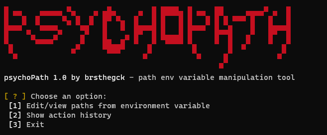
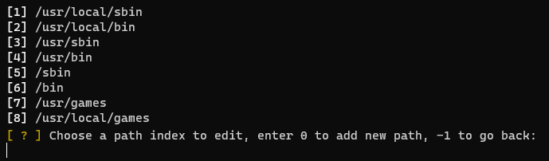

# psychoPath
psychoPath is a small shell script that helps you manage paths in your PATH environment variable with command line interface. You can list, add, edit and remove paths. All the changes are logged in .bashrc in your home directory in case you need to revert your PATH variable back from a specific date. You can also briefly list action history from the script.




#### Usage
Just source the script with:
```
source psychopath.sh
```
or with:
```
. psychopath.sh
```